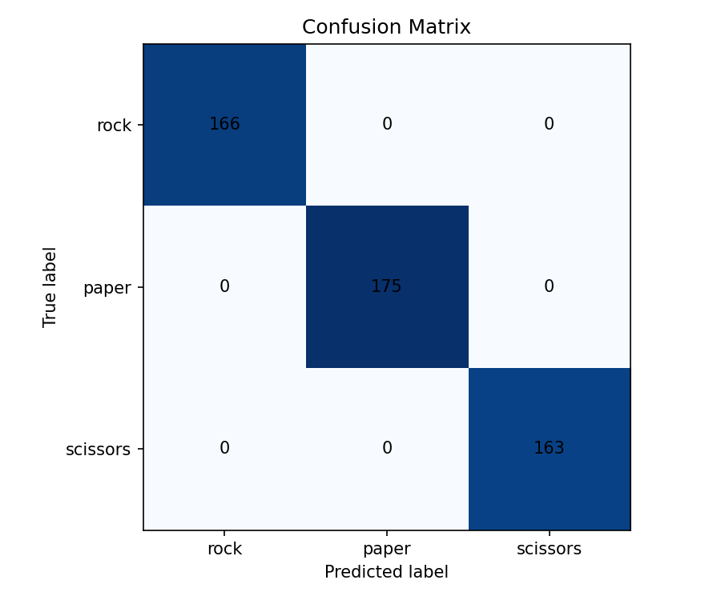

# Image Classifier with Explainability

A computer vision project that classifies hand gestures as **Rock**, **Paper**, or **Scissors** using a Convolutional Neural Network (CNN).

The project demonstrates the complete machine learning workflow:

* dataset preparation
* model training
* evaluation
* prediction
* testing
* deployment with Streamlit

---

# Demo

## Example Prediction

```bash
python -m src.predict data/rock/rock01-000.png
```

Output:

```text
Prediction: rock
Confidence: 99.60%
```

## Confusion Matrix



---

# Streamlit App

The project includes a beginner-friendly Streamlit app for image prediction.

## Run the app

1. Install dependencies:

```bash
pip install -r requirements.txt
```

2. Make sure the trained model file exists:

```text
models/rps_classifier.keras
```

3. Start Streamlit:

```bash
streamlit run app.py
```

4. Upload a `.png`, `.jpg`, or `.jpeg` image of a hand gesture.

The app will:

* show the uploaded image
* predict `rock`, `paper`, or `scissors`
* display the confidence score
* display the probability for all three classes

## If the app cannot find the model

If `models/rps_classifier.keras` is missing, the app will show an error message instead of crashing.

---

# Real-World Testing

Validation accuracy and real-world accuracy are not always the same.

The validation split in this project comes from the same original dataset used for training, so many images share similar lighting, framing, backgrounds, and gesture styles. Because of that, validation results can look very strong even when the model is less reliable on new photos taken in everyday conditions.

To track real-world performance, use the folders below:

* `real_world_tests/rock`
* `real_world_tests/paper`
* `real_world_tests/scissors`

Add external photos to the correct folder, then run:

```bash
python real_world_evaluation.py
```

This workflow will:

* evaluate every image in `real_world_tests`
* save incorrect predictions to `docs/screenshots/real_world_failures/`
* generate `docs/real_world_results.md`

One especially useful failure to watch for is a real-world scissors image predicted as rock. That kind of mistake is a reminder that a model can look excellent on a clean validation split while still struggling with unfamiliar angles, cluttered backgrounds, or different lighting in the real world.

---

# Results

## Dataset

| Metric          | Value |
| --------------- | ----: |
| Total Images    | 2,520 |
| Training Images |       |
